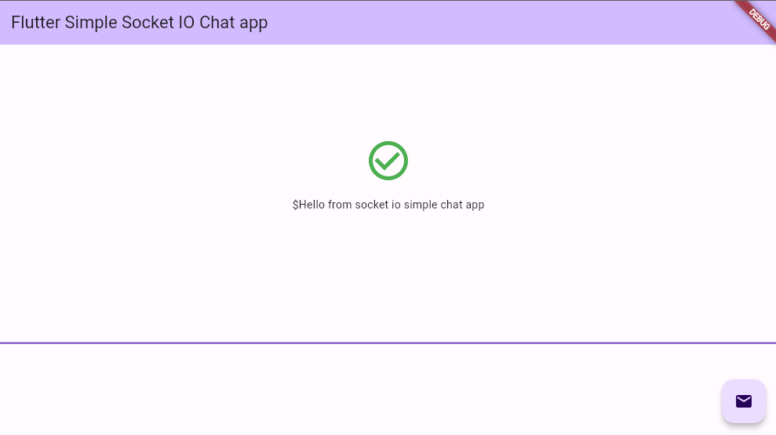

# Simple Socket IO Flutter Application with Provider

A simple Flutter application playing with socket.io for chat application with socket-io-client package https://pub.dev/packages/socket_io_client and provider https://pub.dev/packages/provider

